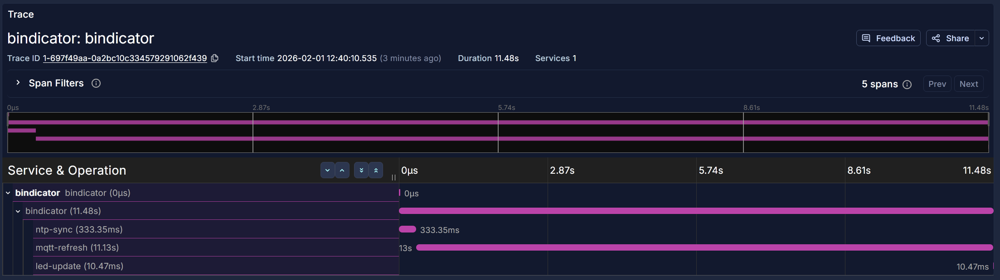
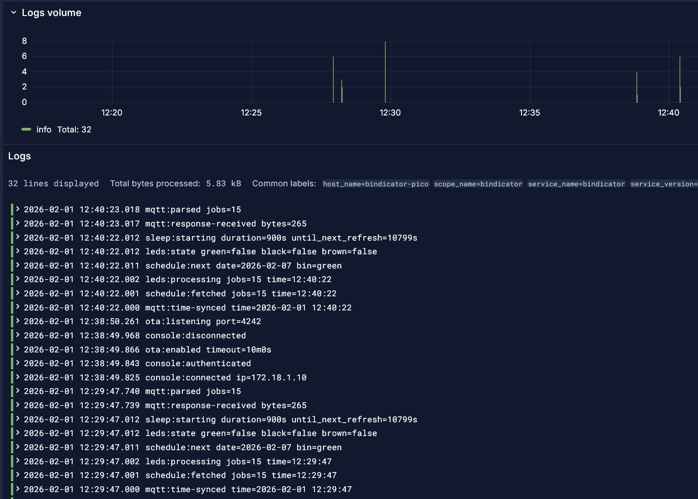
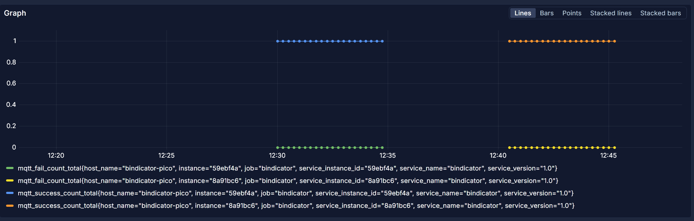

# Telemetry

The Bindicator includes an OpenTelemetry-compatible telemetry module for sending logs, metrics, and traces to an OTLP collector.

## Overview

The telemetry module is designed for embedded systems with:

- **Zero-heap design**: All buffers pre-allocated at compile time
- **OTLP/HTTP JSON format**: Compatible with OpenTelemetry Collector, Jaeger, Grafana Alloy, etc.
- **Queue-based async sending**: Non-blocking operation with 30-second flush interval
- **Automatic slog bridge**: All application logs automatically queued for telemetry
- **Distributed tracing**: Full trace context with parent-child span relationships

## Configuration

### Telemetry Collector Address

Create `config/telemetry_collector.text` with your OTLP collector address:

```
192.168.1.100:4318
```

Port 4318 is the standard OTLP HTTP port. The module sends to:

| Endpoint | Data Type |
|----------|-----------|
| `/v1/logs` | Log records |
| `/v1/metrics` | Metrics (gauges and counters) |
| `/v1/traces` | Trace spans |

### Enable/Disable Telemetry

Telemetry is **enabled by default**. To disable, create `config/telemetry_enabled.text` with:

```
false
```

When disabled:
- No collector address is required
- All telemetry functions become no-ops (zero overhead)
- Application logs still output to serial console via slog

## Traces

Each wake cycle generates a complete distributed trace showing the device's operations:



### Span Hierarchy

```
wake-cycle (root span, ~11s)
├── ntp-sync (~333ms)
│   └── status: "offset:+0.5s" or error message
├── mqtt-refresh (~11s)
│   └── status: "jobs:15" or error message
└── led-update (~10ms)
```

### Span Status Messages

Spans include status messages with operation results:

| Span | Success Status | Error Status |
|------|---------------|--------------|
| `ntp-sync` | `offset:+1.234s` | Error message (e.g., "timeout") |
| `mqtt-refresh` | `jobs:15` | Error message (e.g., "connection refused") |
| `led-update` | - | - |

Status messages are truncated to 48 bytes to fit the fixed buffer.

### X-Ray Compatible Trace IDs

Trace IDs are generated in AWS X-Ray compatible format:
- First 4 bytes: Unix timestamp (seconds)
- Remaining 12 bytes: Random

This enables seamless integration with AWS X-Ray if using the OTLP-to-X-Ray exporter.

## Logs

Application logs are automatically bridged to telemetry via the slog handler:



### Log Format

Logs include:
- Timestamp (nanosecond precision)
- Severity level (DEBUG, INFO, WARN, ERROR)
- Message body
- Trace context (traceId, spanId) when within a span

### Log Severity Levels

| Level | OTLP Number |
|-------|-------------|
| DEBUG | 5 |
| INFO | 9 |
| WARN | 13 |
| ERROR | 17 |

## Metrics

The module records operational metrics as OTLP counters:



### Available Metrics

| Metric | Type | Description |
|--------|------|-------------|
| `mqtt.success.count` | Counter | Successful MQTT refresh operations |
| `mqtt.fail.count` | Counter | Failed MQTT refresh operations |

## Console Commands

| Command | Description |
|---------|-------------|
| `telemetry` | Show telemetry status (enabled, queue sizes, sent counts, errors) |
| `telemetry-flush` | Force immediate flush of all queued data |

### Example Output

```
> telemetry
Telemetry Status:
  Enabled: true
  Collector: 192.168.1.100:4318
  Queued: logs=2 metrics=4 spans=1
  Sent: logs=156 metrics=312 spans=52
  Errors: 0
```

## OTLP Compatibility

The module produces standard OTLP JSON payloads compatible with any OpenTelemetry-compatible backend:

- **OpenTelemetry Collector**: Direct ingestion on port 4318
- **Grafana Alloy**: Via OTLP receiver (shown in screenshots)
- **Grafana Tempo**: For trace storage
- **Grafana Loki**: For log storage
- **Jaeger**: Via OTLP receiver
- **Honeycomb, Datadog, etc.**: Via their OTLP endpoints

### Resource Attributes

All telemetry includes these resource attributes:

| Attribute | Value | Example |
|-----------|-------|---------|
| `service.name` | `bindicator` | - |
| `service.version` | Build version | `1.0` |
| `service.instance.id` | Git SHA (7 chars) | `59ebf4a` |
| `host.name` | `bindicator-pico` | - |

### Span Status Codes

| Status | OTLP Code | When Used |
|--------|-----------|-----------|
| Unset | 0 | Never (always set explicitly) |
| OK | 1 | Operation succeeded |
| Error | 2 | Operation failed |

## Memory Budget

The telemetry module uses approximately 8.5KB of statically allocated memory:

| Component | Size |
|-----------|------|
| TCP Tx Buffer | 2.5KB |
| TCP Rx Buffer | 512B |
| Body Buffer | 2KB |
| Response Buffer | 256B |
| Log Queue (8 entries) | ~1.7KB |
| Metric Queue (8 entries) | ~400B |
| Span Queue (4 entries) | ~500B |
| Config/State | ~200B |
| **Total** | **~8.5KB** |

## Trace Context

The module maintains proper trace context throughout each wake cycle:

1. `GenerateTraceID()` creates a new X-Ray compatible trace ID
2. `StartServerSpan("wake-cycle")` begins the root span
3. Child spans (`ntp-sync`, `mqtt-refresh`, `led-update`) automatically inherit trace context
4. `SetSpanStatus(idx, msg)` records operation results
5. `EndSpan(idx, success)` completes each span
6. Sibling spans correctly share the same parent

### Span Lifecycle

```
StartSpan() → SetSpanStatus() → EndSpan()
     ↓              ↓              ↓
  Active=true   StatusMsg set   Active=false
                               Pending=true
                                    ↓
                              (30s flush)
                                    ↓
                              Pending=false
                              (slot reusable)
```

The `Pending` flag ensures completed spans aren't overwritten before being flushed to the collector.

## Background Sender

Telemetry data is sent asynchronously:

- **Flush interval**: Every 30 seconds
- **Timeout**: 10 seconds per HTTP request
- **Retries**: 2 attempts on failure
- **Non-blocking**: Main loop never waits for telemetry
- **Pause support**: Telemetry pauses during OTA updates

## Running a Local Collector

### Grafana Alloy (Recommended)

```alloy
otelcol.receiver.otlp "default" {
  http {
    endpoint = "0.0.0.0:4318"
  }
  output {
    logs    = [otelcol.exporter.loki.default.input]
    metrics = [otelcol.exporter.prometheus.default.input]
    traces  = [otelcol.exporter.otlp.tempo.input]
  }
}

otelcol.exporter.loki "default" {
  forward_to = [loki.write.default.receiver]
}

otelcol.exporter.prometheus "default" {
  forward_to = [prometheus.remote_write.default.receiver]
}

otelcol.exporter.otlp "tempo" {
  client {
    endpoint = "tempo:4317"
  }
}
```

### OpenTelemetry Collector

```yaml
# otel-collector-config.yaml
receivers:
  otlp:
    protocols:
      http:
        endpoint: 0.0.0.0:4318

exporters:
  logging:
    loglevel: debug

service:
  pipelines:
    logs:
      receivers: [otlp]
      exporters: [logging]
    metrics:
      receivers: [otlp]
      exporters: [logging]
    traces:
      receivers: [otlp]
      exporters: [logging]
```

```bash
docker run -p 4318:4318 \
  -v $(pwd)/otel-collector-config.yaml:/etc/otelcol/config.yaml \
  otel/opentelemetry-collector:latest
```

## Testing with netcat

To verify the device is sending telemetry:

```bash
# Listen on OTLP port
nc -l 4318

# You should see HTTP POST requests like:
# POST /v1/logs HTTP/1.1
# Host: 192.168.1.100:4318
# Content-Type: application/json
# ...
```

## Disabling Telemetry

To disable telemetry, create `config/telemetry_enabled.text` containing `false` or `0`:

```bash
echo "false" > config/telemetry_enabled.text
```

When disabled:
- Telemetry collector address is not required
- All telemetry API calls become no-ops
- No background sender thread is started
- slog bridge continues to output logs to serial console

To re-enable, either:
- Remove the file
- Empty the file
- Set contents to anything other than `false` or `0`
